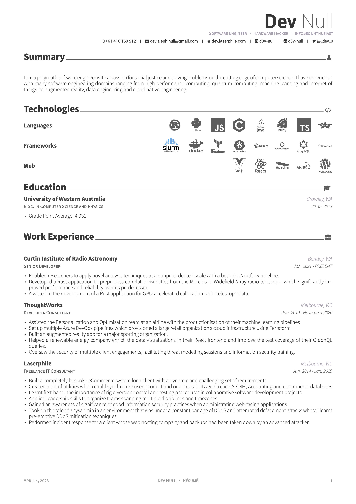
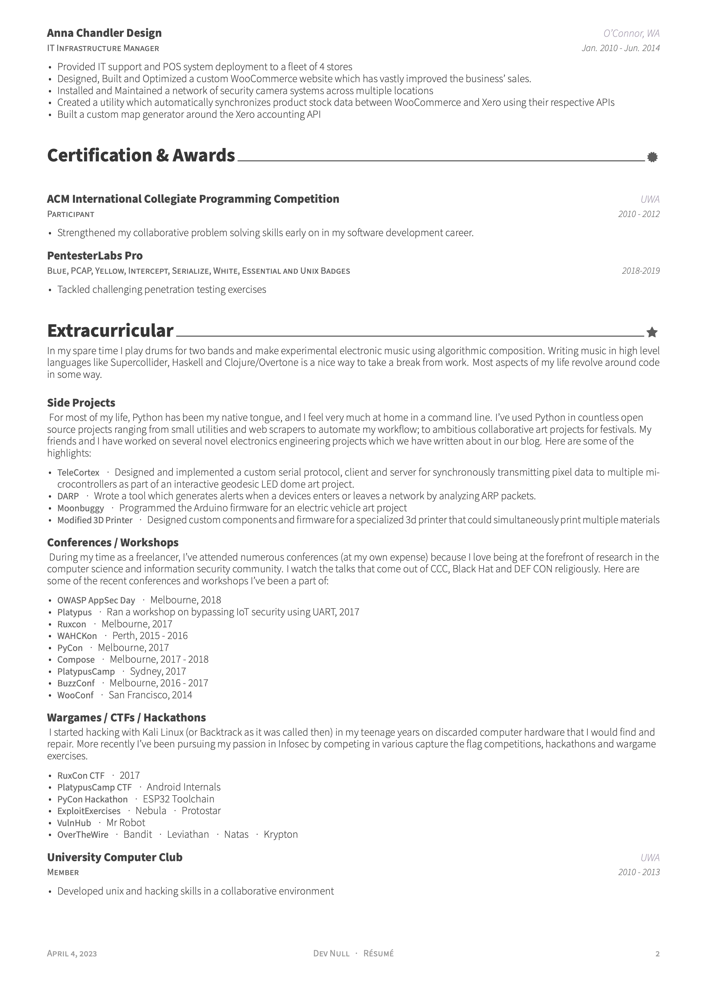

# Compiling

## Install submodules

```bash
git submodule update --init --recursive
```

## Install LaTeX

```bash
brew install --cask basictex font-icomoon font-fontawesome
```

## install LaTeX modules / fonts

```bash
sudo tlmgr update --self
sudo tlmgr install titlesec framed threeparttable wrapfig multirow enumitem bbding titling tabu mdframed tcolorbox textpos import varwidth needspace tocloft ntheorem environ trimspaces xifthen ifmtarg latexmk collection-fontsrecommended fontawesome sourcesanspro svg transparent catchfile tikzfill
```

## Install otf fonts

- <https://fontawesome.com/v4.7.0/assets/font-awesome-4.7.0.zip>

## Install packaged font

double click on `fonts/devicons.ttf` to install with FontBook

## Compile to LaTeX

```bash
xelatex --shell-escape resume_derwent_awesome.tex
```

## Preview




*Note:* The references section and my personal contact info was deliberately excluded from these previews for privacy reasons, please contact me for references.
